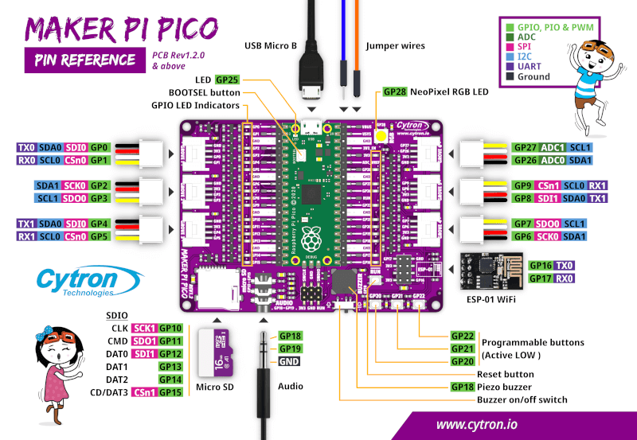

# Cytron Maker Pi Pico - MQTT 
## RaspberryPi Pico RP2040 board + ESP8266 ESP01 with AT Firmware
Example firmware to comunicate pico to Homeassistant over MQTT trough ESP8266 with AT firmware.
### Arduino Framework on PlatformIO
